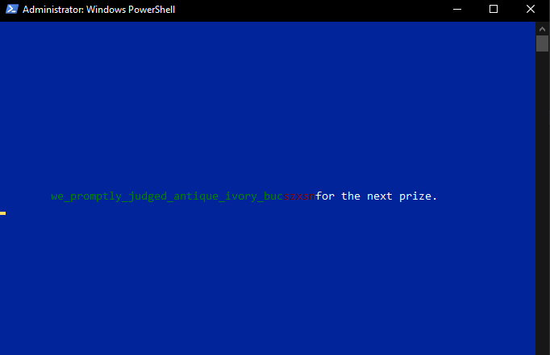

## touch typing practice right from the terminal

#### install all requirments
`> pip install r- requirements.txt`

#### Pass path to folder as first and only argument (absolute or relative path)
`> python main.py`

#### create alias for python <path to file>
`> type_game`

